# Histometer — a guided tour

Histometer tracks histology samples from intake through processing, embedding,
sectioning, staining, imaging and analysis. This walkthrough follows a single
block, **EE‑1**, all the way through the pipeline and then shows the records,
tagging, request, export and backup features.

> The screenshots are generated automatically by a Playwright walkthrough
> (`tests/tutorial/showcase.spec.ts`). To regenerate them after a UI change:
> `npx playwright test --config playwright.showcase.config.ts`

---

## 1. The board

Histometer opens on the **board** — a set of lanes that mirror the physical lab
workflow. The top lane is *Processing & Embedding*; the bottom lane is
*Sectioning & Analysis*. Work moves left‑to‑right, mostly by drag‑and‑drop.

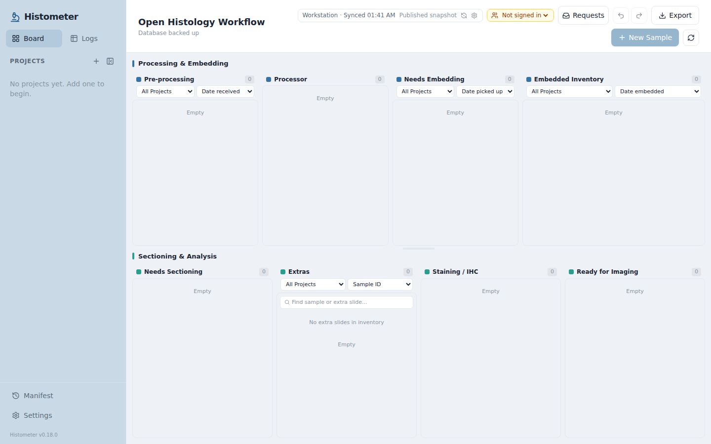

Top‑right you'll find the signed‑in user, **Requests**, **undo/redo**,
**Export** and **New Sample**. **Manage**, **Backups** and the theme picker are
under **Settings** at the foot of the sidebar, which also shows the current app
version.

## 2. Set up people, projects and stains

Open **Manage** (under **Settings**) to add lab users, projects and the
stain/IHC catalog. Add yourself and sign in: the board can be read by anyone,
but nothing can be changed until somebody is signed in, and every change is
recorded against that person.

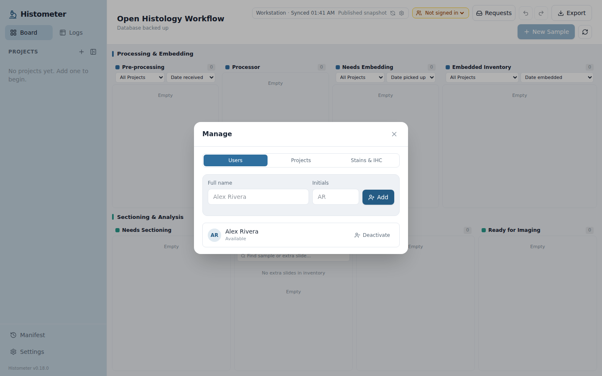

Create a project (a short code + a name). Every sample is numbered within its
project, and shown as `EE‑1`, `EE‑2`, … everywhere in the app and in the
exports.

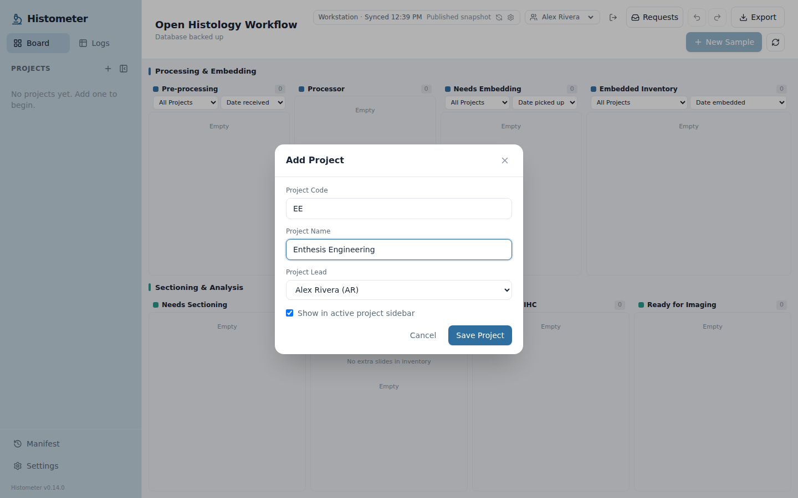

## 3. Log a sample

**New Sample** records a block: the project it belongs to (asked only when the
lab has more than one), description, processing type (Short/Long),
fixative, whether it needs decalcification, **embedding notes** for whoever
picks up the mould (how it should be oriented, whether it is bisected), and any
stains you already know you want. It lands in **Pre‑processing**.

With **Quantity** above 1, Embedding Notes gets a switch: **One note for all**
saves the same note on every sample in the batch, and **A note for each** gives
every sample code its own line (leave a line blank for none). Switching keeps
what you typed in the other mode; only the mode on screen is saved.

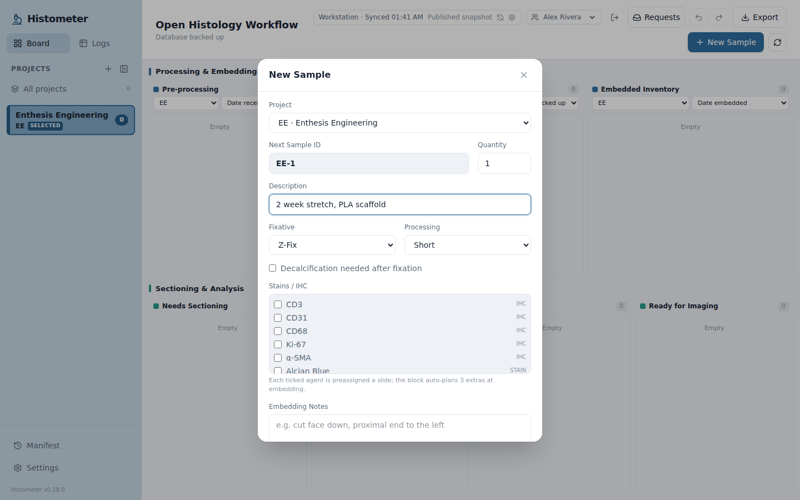

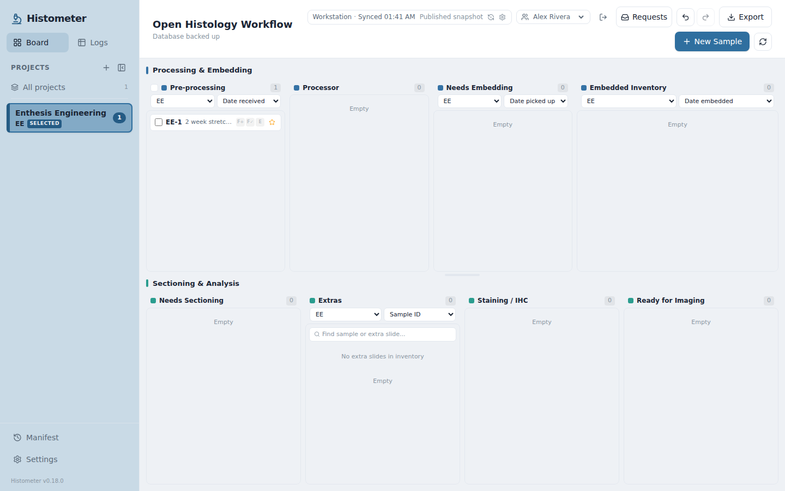

## 4. The sample drawer

Click any tile to open its **detail drawer**. Here you can:

- work the **pre‑processing checklist** (fixative → removed → ethanol, etc.),
- change the sample's **project** (it re‑numbers and re‑labels its slides),
- **request a stain**, and
- edit the **timeline** (click any timestamp).

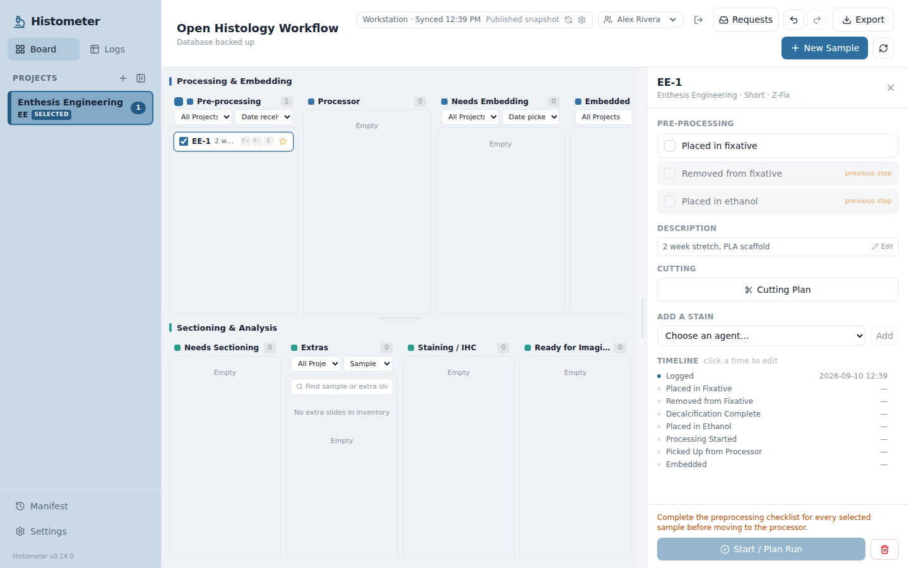

> Tip: click a tile again — or untick its checkbox — to de‑select it and close
> the drawer.

## 5. Run the processor

Drag the block onto **Processor** to open the run dialog. A run started now
processes immediately; give it a future start time to *plan* it instead. Batches
carry a checklist and auto‑advance on their timer.

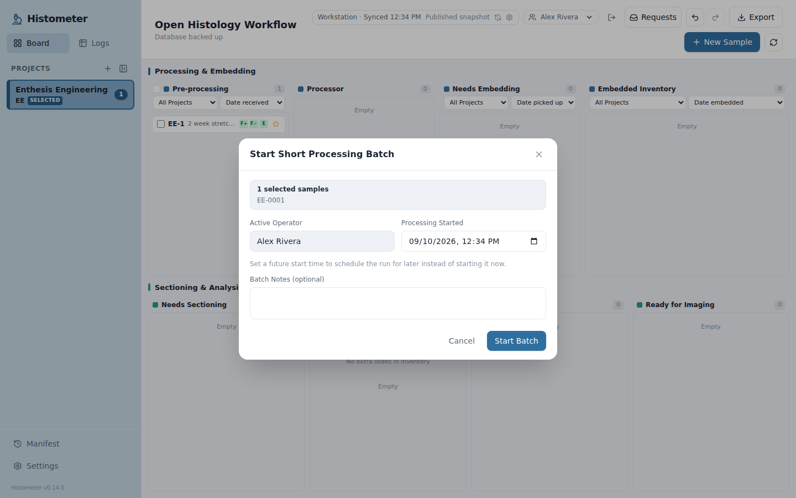

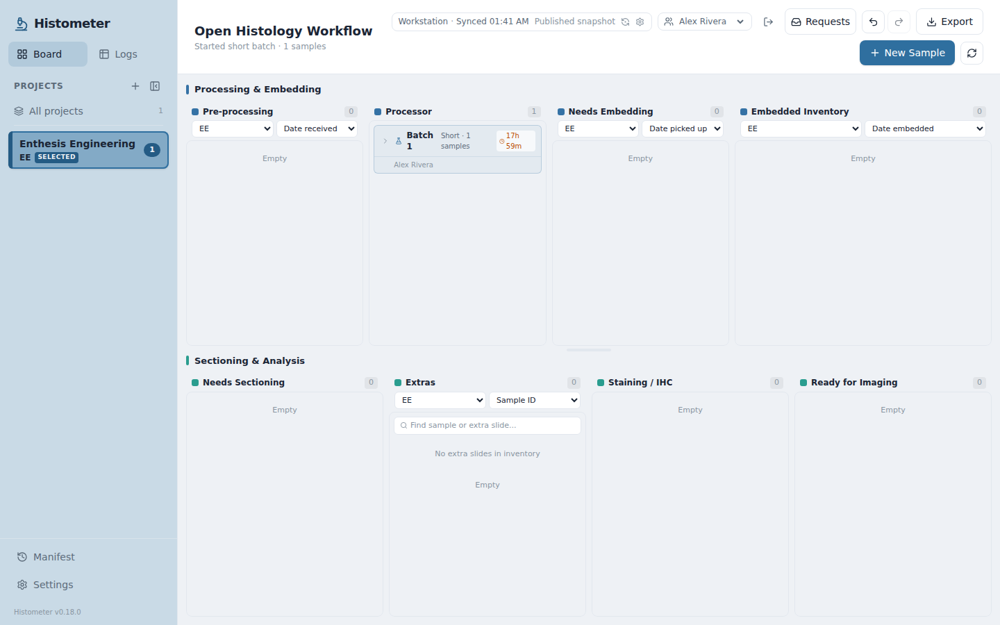

Drag the finished batch to **Needs Embedding**, then drag the block to **Embedded
Inventory** once it's embedded.

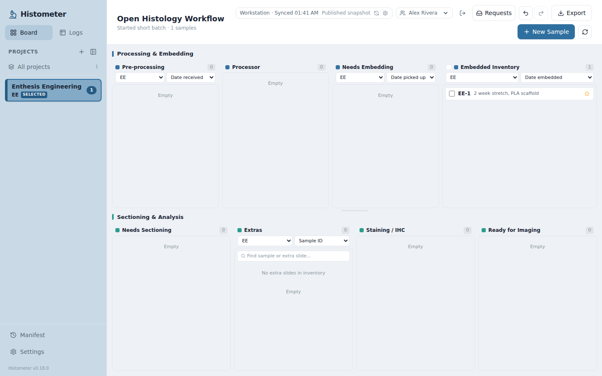

## 6. Send for cutting

From an embedded block, **Send for Cutting** asks how many slides to cut and
which carry a stain — everything else is an *extra* (kept in inventory for later
requests). If the block had stains preselected, the plan is prefilled.

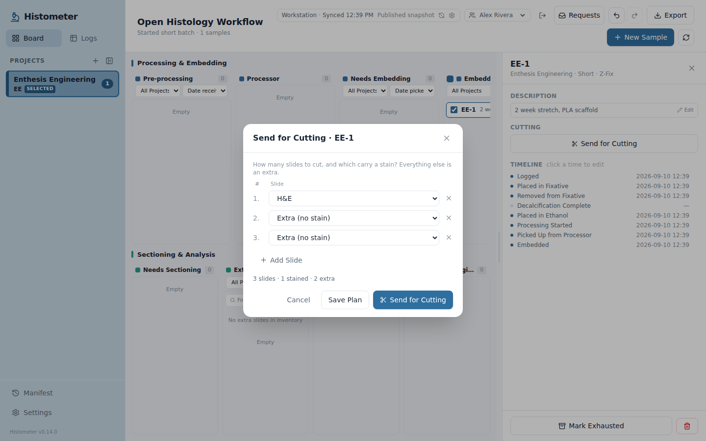

The cut appears in **Needs Sectioning**. The tile shows a compact tally, e.g.
"H&E · 3× Extra".

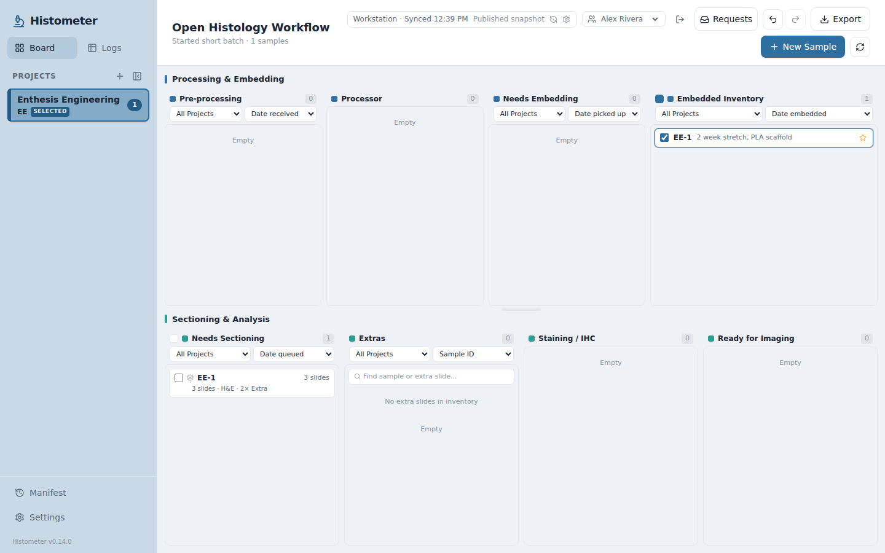

## 7. Staining protocol

Open the Needs Sectioning card and **Mark Sectioned**. Slides carrying a stain
form a **rack** in *Staining / IHC*; extras drop into inventory. Open a rack and
tick off the protocol steps (**Stained → Coverslipped**); each step is recorded
against the signed‑in user. Finishing the last step advances the slides
to *Ready for Imaging*.

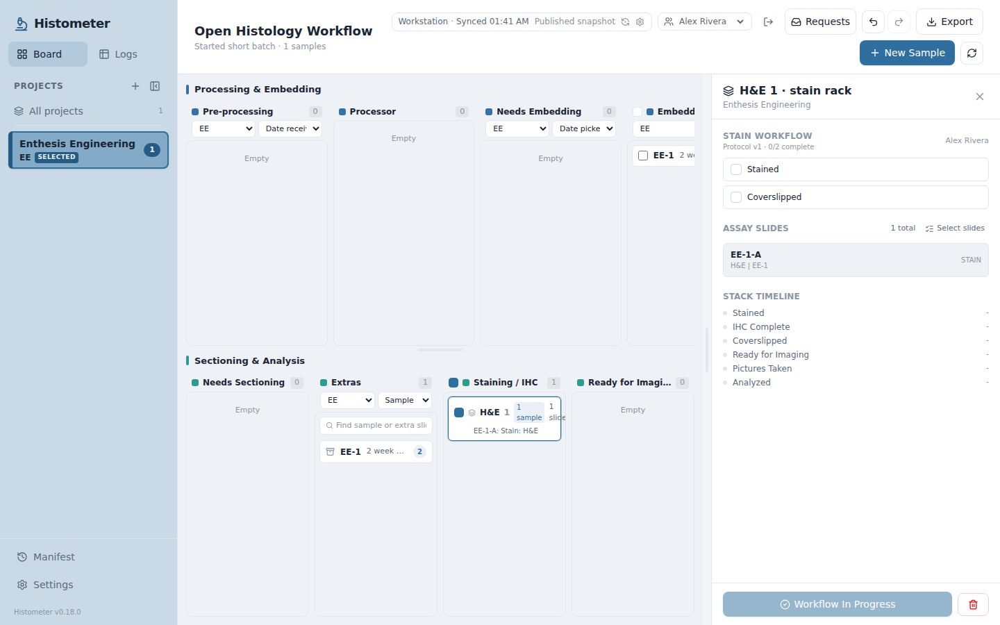

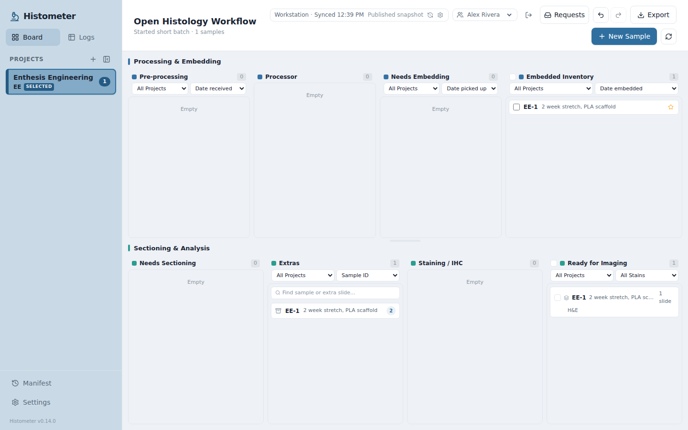

## 8. The Logs view

Switch to **Logs** for a spreadsheet of every sample and slide. Sort by any
column; filter by project, stain/IHC, stage, assay type, or date; search across
codes, descriptions, stains and notes. Stains that are assigned but not yet cut
are listed too, marked *(assigned)*, so the log says what the board says — the
stain and assay-type filters and the search find them, and the CSV/Excel export
carries them as rows with no slide ID, stage `requested (not cut)`. A block
marked exhausted shows an **Exhausted** badge and, since it can no longer be
cut, no *(assigned)* stains. Export the current view as CSV or Excel.

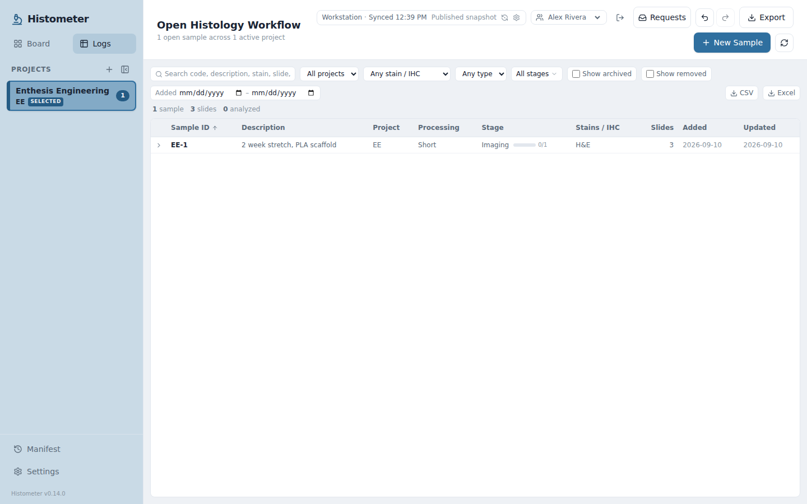

Expand a sample for its timeline, notes and slides — each slide has its own
condensed timeline and notes. The sample's four notes (Embedding, Sectioning /
Cut, Slide and General) are **editable right there**: correct one, click away to
save it, `Ctrl+Z` to take it back. A note nobody wrote at intake gets an empty
box you can fill in later. A read-only viewer reads them, and is shown only the
notes the block actually carries.

## 9. Depth tagging (optional)

Depth tags are a **low‑effort, relative** way to group slides — nothing requires
them. Tick the slides that belong together; a bar appears. The same bar can
also reassign the ticked slides to another agent or remove them, with a reason.

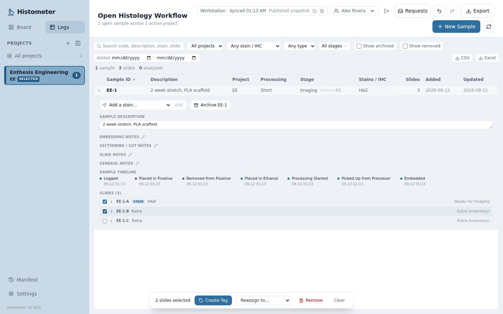

Click **Tag depth**, give the group a free‑text label (e.g. "surface", "100µm
deep") and an optional note.

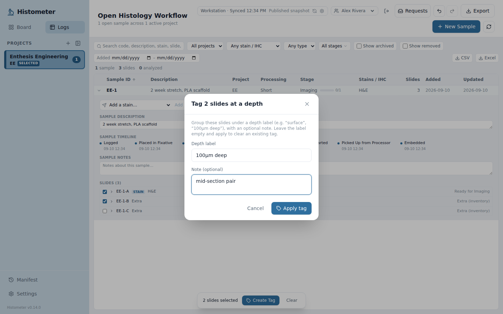

The label shows as a badge on each tagged slide (the note is on hover), and it's
included in exports. Tag one set "surface" and another "deep" to record that one
is deeper than the other — the ordering is just your words. Apply an empty label
to clear a tag.

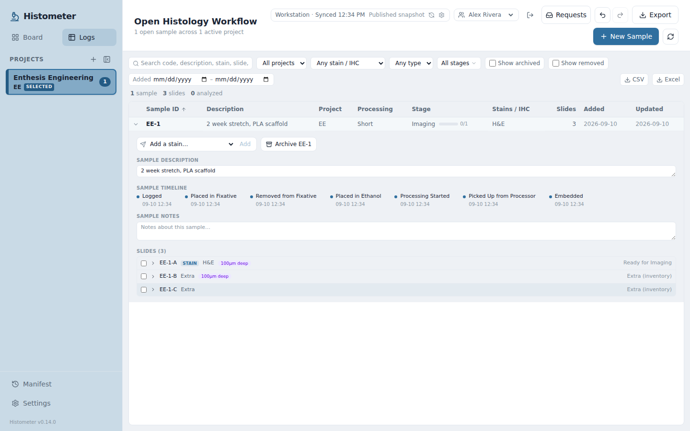

## 10. Add a stain

Expand a Logs row and pick from **Add a stain…** — the block is already scoped,
so there is no code to type. The sample drawer offers the same control. If a
free extra exists it's pulled straight into staining; otherwise the block is
flagged for a fresh cut and the stain shows in the Logs as *(assigned)* until it
is. A read‑only viewer instead files a formal request for the workstation to
action.

## 11. Export

**Export** produces an Excel workbook (Projects, Samples, Cut Orders, Slides,
Processing Batches) or a Samples CSV. Slide‑level detail — including depth tags
and block exhaustion — is included.

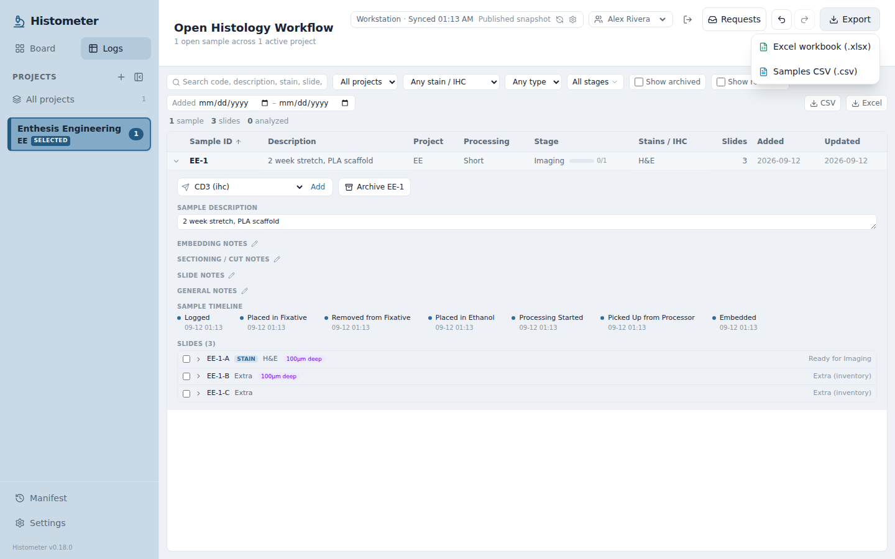

## 12. Backups

**Backups** keeps robust, point‑in‑time copies of the whole database. The
workstation saves one automatically every few hours during the working day (all
configurable), and you can **Back up now** or **Revert** to any snapshot at any
time.
A revert first brings the backup up to this version of Histometer, then takes a safety backup, so it's itself reversible.
A backup it cannot bring up to date, such as one made by a newer version, is refused with the reason, and nothing changes.

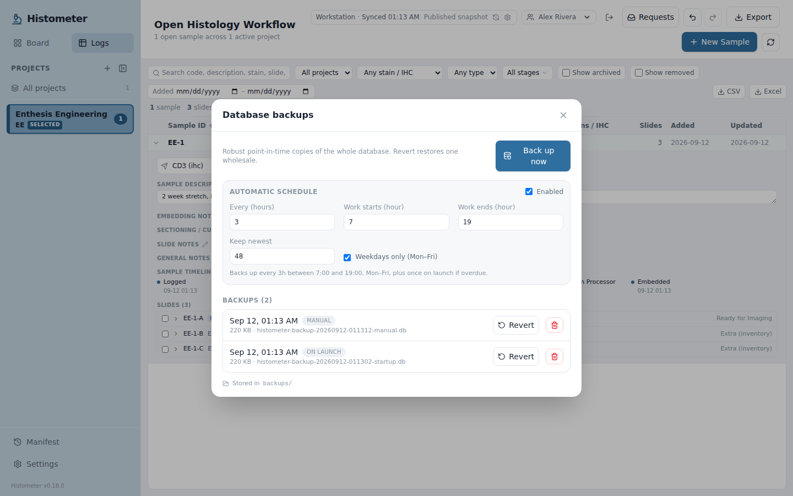

---

## Also worth knowing

- **Undo / redo** (Ctrl+Z / Ctrl+Y, or the toolbar arrows) revert whole actions —
  moves, cuts, protocol steps, tags — one step at a time.
- **Themes** live under **Settings**: many light and dark ones, and **Customize
  colours…** to build your own while the board repaints behind it.
- **Sync** — a workstation can publish its database to a private repo that
  read‑only **viewer** installs pull from; viewers can submit stain requests back.
  All instances must run the same version.
